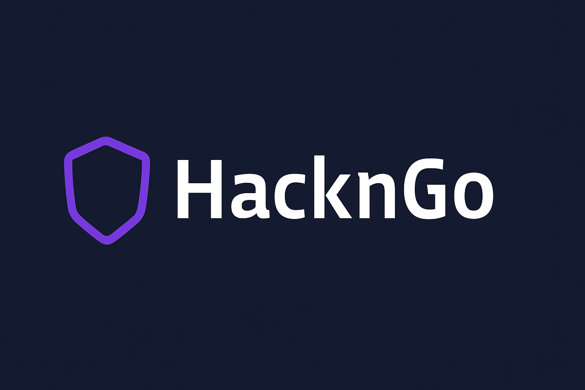
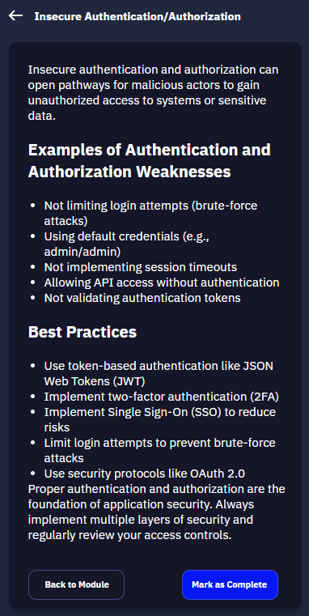
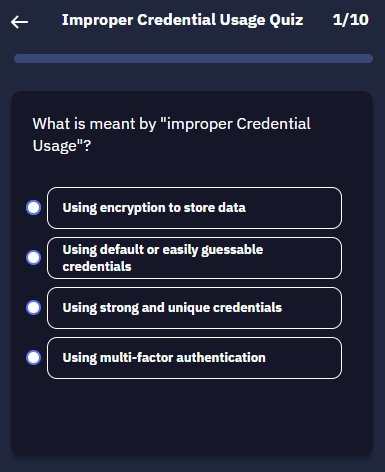
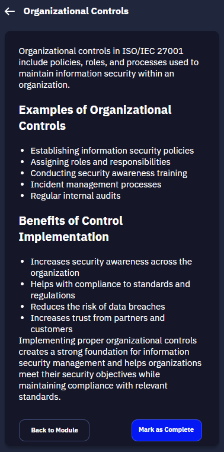
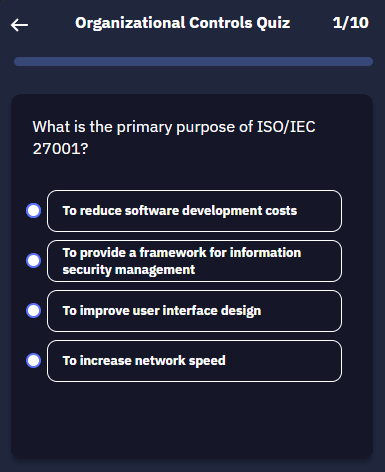

# Hack’n Go: Web-Based Cybersecurity Education Game Inspired by Duolingo

<p align="center" width="100">
  
</p>

[](LICENSE)


Hack’n Go is a beginner-friendly web application designed to gamify cybersecurity education through interactive quizzes and bite-sized learning modules. Inspired by Duolingo, the app empowers users to learn crucial cybersecurity concepts while earning points, tracking progress, and competing with others on the leaderboard.

This project was developed as part of a university Software Engineering course by a team of cybersecurity students, aiming to create an accessible platform for raising cybersecurity awareness across different skill levels.

---

## 🔥 Why Hack’n Go?

In a digital age where cyber threats are evolving rapidly, many users remain unaware of basic security practices. Hack’n Go was built to bridge this knowledge gap by offering a simple, fun, and accessible way to learn cybersecurity fundamentals. The app focuses on technical topics such as OWASP Top 10 and ISO 27001, repackaged into modules and quizzes designed for hands-on microlearning.

Unlike traditional learning platforms, Hack’n Go uses gamification elements such as daily challenges, levels, and leaderboards to keep users motivated. This approach encourages consistent learning and helps foster healthy cybersecurity habits for individuals, students, and professionals alike.

---

## ✨ Main Features

| No. | Feature                     | Description |
|:---:|-----------------------------|-------------|
| 1.  | Interactive Cyber Quizzes   | Answer gamified quizzes on topics like OWASP Top 10 and ISO 27001. Each level presents 10 randomized questions with instant feedback. |
| 2.  | Learning Modules            | Understand security topics through simplified, beginner-friendly modules before starting the quiz. |
| 3.  | Daily Challenge & Points    | Earn XP daily through quizzes and challenges to maintain a learning streak and unlock achievements. |
| 4.  | Leaderboard System          | Compete with other users based on points and progress to stay on top of the cybersecurity leaderboard. |
| 5.  | Responsive Web Design       | Hack’n Go is designed to run on both desktop and mobile browsers. |
| 6.  | User Progress Tracking      | Each user can track completed levels, earned XP, and badges via the Profile tab. |

---

## 🧰 Requirements

Before running the application, make sure you have:

- [Node.js](https://nodejs.org/) (v18 or higher recommended)
- npm (usually comes with Node.js)
- Modern web browser (Chrome, Firefox, Edge, etc.)

---

## 🚀 Getting Started

### 1. Clone the repository

```bash
git clone https://github.com/your-username/hack-n-go.git
cd hack-n-go
```

### 2. Run the app locally

**First**
Double-click the following script:
```bash
install-server.bat
```
OR, from terminal:
```bash
./install-server.bat
```
**Second**
Double-click the following script:
```bash
start-server.bat
```
OR, from terminal:
```bash
./start-server.bat
```
By default, the app will be available at:

```arduino
http://localhost:3000
```
💡 No complex setup or installation—everything runs locally and instantly!

## 🧪 Sample Content (Preview)

| Category     | Learning Module Preview                          | Quiz Preview                          |
|--------------|--------------------------------------------------|----------------------------------------|
| OWASP Top 10 |             |    |
| ISO 27001    |                 |        |

## 🖊️ Figma Design

Link : www.figma.com/design/Xzf0Tc1dUtNw6pzBiqfmmI/HackNGo?node-id=0-1

## 👨‍💻 Authors

- **minzelo** — Raihan Rahman Syah Putra (2702211941) — Backend
- **JohnSmith-Cloud** — Algifary Noer Umaro (2702293506) — Quiz & Learning Content
- **Agi-123** — Andragi Bianca (2702385791)  
- **snakebytee** — Darrius Wirya Prajna (2702303791) — Backend & Frontend Merge
- **eyetolog1st** — Samuel Adrian Murwanto (2702244984) — Design & Frontend

## 🔮 Future Works

While Hack’n Go is currently functional as a cybersecurity learning platform, there are several features we plan to enhance in future iterations:

- **Leaderboard Functionality**  
  The leaderboard UI is in place, but real-time score tracking and dynamic ranking are still under development. This feature will allow users to compete and track progress globally.

- **Interactive Polishing**  
  Additional UI/UX improvements are planned to enhance animations, responsiveness, and interactivity—especially on mobile views and during quiz transitions—to create a more engaging experience.

> Contributions and feature suggestions are welcome as we continue improving Hack’n Go in the next development phase.

🎓 Hack’n Go is an open-source educational tool developed as part of a university cybersecurity project and is not intended for commercial distribution. Contributions and feedback are welcome!
